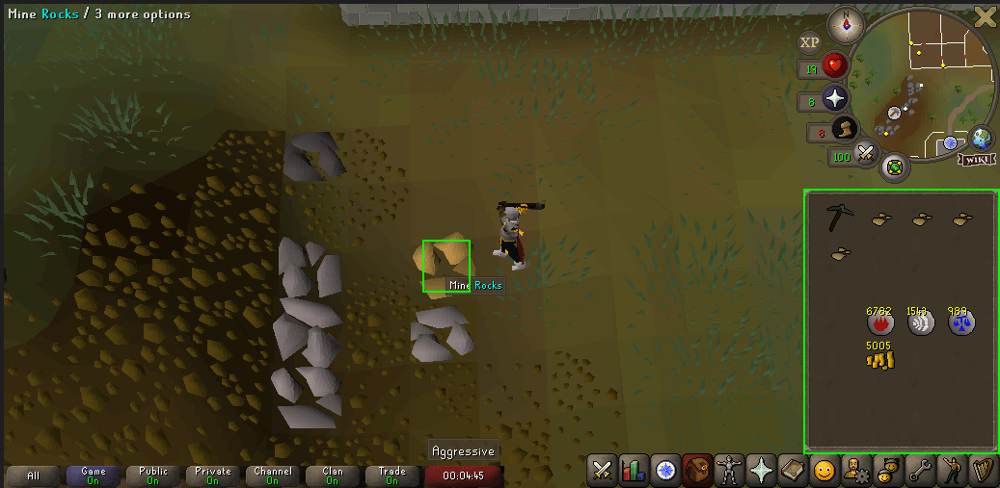
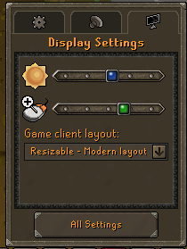

	
	
	

<h1> The best free mining script for Old School Runescape (OSRS) made with autoHotKey (AHK)</h1>

	

This script is made in autoHotKey, it has a logic easy to understand and can be edited for anyone who have a base knowledge of ahk.

You will notice that this free software is open source and you have right to use, edit, copy etc, under the terms of the licence. A copy of the licence is distributed with the software.	

### What this ahk mining script do

This macro is hable to mine itself iron ore, copper ore and clay for long time whitout interruption, in any location of OSRS, with litte configuration. You can add more rocks too. This script work with color detection, trying to imitate human logic doing mining. It do not use relfection or inyection, like others bots do. 

This script will be usefull for you if you want afk mining while studiying or working, or if you need some help to train your mining skill and be hable of do a new quest, or simple if you do not like to do mining.

### Steps to use it

0. Download RuneLite: 
	This script does not work outside of RuneLite be default. https://runelite.net/
	
1. Dowload AHK from his website:
	You need to download the AHk interpreter and install it on your Windows, then you can run any .ahk file. https://www.autohotkey.com/
	
2. Download the script:
	Either cloning the code or using the release link.

4. Run the script the first time:
	Just double click to run the script. You will see the terms of the licence the first time and later you will see the instructions of use. 

5. Beging mining where you want:
	Go to any place where you want to mine and use the short-cut "Ctrl + LeftClick" to define an area where a rock is. Later press Alt + i to initiate the mining process and you keep afk. (see instructions for more details)

### Initial configurations

 

1. Ajust Brigthness as needed:
	The script use color match to found rocks and other things, the brigthness configuration can modify the colors suficient enought to make the script fail.
	
2. Ajust layout to Modern-layout

3. The angle of the camera can be a factor. It is better to maintain it vertical.

3. Beging mining where you want:
	Go to any place where you want to mine and use the short-cut "Ctrl + LeftClick" to define an area where a rock is. Later press Alt + i to initiate the mining process and you keep afk. (see instructions for more details)

### Finally
You are the unique responsible of how you use this script, and therefore for any problem/ ban on your account. This script do not imitate human on a 100%.

I like to develop this macro with AHK and i will upgrade it over time. I will like to hear you, hit me up on discord and tell me if you found a bug or just how is going your mining journey.